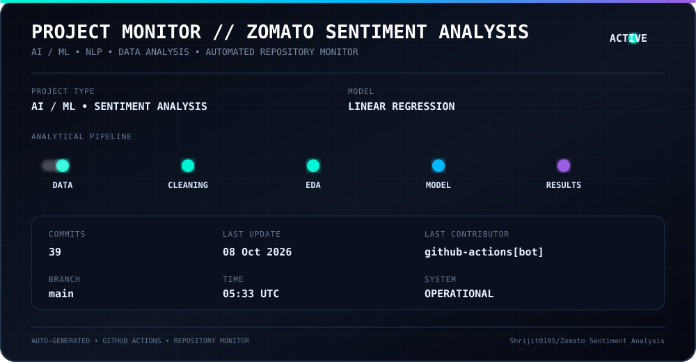

# 🍽️ Zomato Sentiment Analysis

<div align="center">

### AI/ML • Natural Language Processing • Exploratory Data Analysis

**Transforming customer reviews into meaningful insights about restaurant experiences.**

</div>

---

## 📌 Project Overview

This project was developed as part of a **2-month AI/ML internship program conducted by Labmentix**.

The project focuses on analysing restaurant and customer-review data to uncover meaningful patterns in the Indian food and restaurant industry.

The workflow combines **data preprocessing, exploratory data analysis, sentiment-oriented review analysis, visualization, and machine-learning techniques** to convert raw customer information into useful insights.

---

## 🎯 Objectives

The primary objectives of this project are to:

- Analyse restaurant-related information and customer reviews.
- Understand patterns within ratings and customer feedback.
- Perform exploratory data analysis on restaurant and reviewer information.
- Convert raw review information into useful analytical insights.
- Visualize important patterns within the dataset.
- Develop a machine-learning model for predictive analysis.
- Understand how customer feedback can support better restaurant decisions.

---

## 📊 Dataset Overview

### 🏪 Restaurant Data

| Feature | Description |
|---|---|
| **Restaurant Name** | Name of the restaurant |
| **URL** | Restaurant's Zomato URL |
| **Cost** | Estimated cost per person |
| **Collection** | Zomato restaurant category/tag |
| **Cuisine** | Cuisine types served by the restaurant |

### 👤 Reviewer Data

| Feature | Description |
|---|---|
| **Reviewer** | Name of the reviewer |
| **Review** | Customer review text |
| **Rating** | Rating given by the customer |
| **Meta Data** | Number of reviews and followers |
| **Time** | Date and time of the review |
| **Pictures** | Images uploaded with the review |

---

## 🔬 Project Workflow

```text
Raw Data
   │
   ▼
Data Inspection
   │
   ▼
Data Cleaning & Preprocessing
   │
   ▼
Exploratory Data Analysis
   │
   ▼
Review & Sentiment Analysis
   │
   ▼
Feature Engineering
   │
   ▼
Model Building
   │
   ▼
Model Evaluation
   │
   ▼
Insights & Visualization
```

---

## 🧠 Technologies Used

| Technology | Purpose |
|---|---|
| 🐍 **Python** | Core programming language |
| 🐼 **Pandas** | Data manipulation and analysis |
| 🔢 **NumPy** | Numerical computation |
| 📈 **Matplotlib** | Data visualization |
| 🤖 **Scikit-learn** | Machine-learning workflow and modelling |

---

## 📈 Exploratory Data Analysis

The EDA phase focuses on understanding the structure and behaviour of the restaurant and customer-review data.

Key areas include:

- Distribution of restaurant ratings
- Customer review patterns
- Restaurant cost analysis
- Cuisine distribution
- Reviewer behaviour
- Relationship between ratings and restaurant attributes
- Identification of useful patterns and trends
- Visual representation of analytical findings

---

## 🤖 Model Building

The final modelling stage uses a **Linear Regression model** for predictive analysis.

The modelling workflow includes:

```text
Feature Selection
       ↓
Data Preparation
       ↓
Train / Test Split
       ↓
Linear Regression
       ↓
Prediction
       ↓
Model Evaluation
```

Model performance is evaluated using appropriate regression metrics to understand the predictive capability of the trained model.

---

## 💡 Project Impact

The analysis demonstrates how unstructured customer feedback and restaurant information can be transformed into actionable insights.

Potential applications include:

- Understanding customer preferences
- Identifying patterns in restaurant ratings
- Supporting restaurant service improvement
- Analysing cuisine and pricing trends
- Helping customers make more informed choices
- Supporting data-driven decisions within the food industry

---

## 📌 Possible Outcomes

The project provides a data-driven view of customer sentiment and restaurant performance.

The analysis can help identify:

- What customers appreciate or dislike.
- How ratings vary across restaurants.
- Relationships between restaurant characteristics and customer ratings.
- Patterns within customer reviews.
- Potential factors influencing restaurant performance.

---

## 📊 Project Monitor

<div align="center">



</div>

> ⚡ The project monitor is automatically generated and updated through GitHub Actions.

---

## 🗂️ Project Structure

```text
Zomato-Sentiment-Analysis/
│
├── data/
│   ├── raw/
│   └── processed/
│
├── notebooks/
│   ├── 01_EDA.ipynb
│   ├── 02_Preprocessing.ipynb
│   ├── 03_Model_Building.ipynb
│   └── 04_Model_Evaluation.ipynb
│
├── models/
│
├── outputs/
│   ├── plots/
│   └── reports/
│
├── assets/
│   └── project-status.svg
│
├── .github/
│   └── workflows/
│       └── project-ui.yml
│
└── README.md
```

---

## 🚀 Key Learning Outcomes

Through this project, I worked with:

- Real-world data preprocessing
- Exploratory data analysis
- Data visualization
- Review-data analysis
- Feature engineering
- Machine-learning model development
- Model evaluation
- GitHub-based project management
- Automated project-status visualization

---

## 👨‍💻 Author

**Shrijit**

BCA Student • AI/ML & Software Development Enthusiast

---

<div align="center">

### 🚀 Turning raw data into useful intelligence.

</div>
